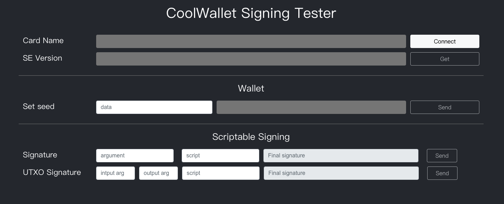

# Script Tester



Script Generator 提供 React 頁面，

## Install and Run

```
npm install
```

```
yarn start
# or
npm start
```


## Example

### Polkadot 

script
```
03020E01C7070000000162CAA0C70002CC071000CAAC570002A2ACD70022FFF6CAACD7002CFFFBA2ACD70031FFFBA2ACD70036FFFBCAACC7003B04CAACC7003F04CAAC570043CAAC570063DC07C003444f54CC0FC00753533538505245CC0F1000CAAC5F00025AF09FC00FBAFCCE6C07230804DDE09700DAACD7C022FFF60AD207CC05065052455353425554546f4e
```

argument
```
15328000002C8000016280000000000000000000000005008eaf04151687736326c9fea17e25fc5287613693c912909cb226aa4794f26a480000000000BEEBCF08000000009999000000000000000000009a0200004d01000091b171bb158e2d3848fa23a9f1c25182fb8e20313b2c1eb49219da7a70ce90c35c697847b25d385178aa150d29e5ce212339c5624183f74bdf45f4912c89749a
```

### Bitcoin (UTXO)

script
```
0400000010C7070000000000C1AC17C0290201010102BAA1C7CC08080F02C1A017C004041976A9140317A91403160014032200201AA017C00903CAAC5700091507C005CAAC270015C1A017C0040288AC018700001AAC17C0295D01BAACC7CC2B08080F02C1AC17C02A03041976A9140317A914031600146CACCF0033151AAC17C02A05005AF097C0091AAC17C02A1001CC0EC00200145AF09EC0095AE097C0091AAC17C02A05025AF097C009C1AC17C02A030288AC018700DC07C003425443250E00250F0012A017C0220001C1A01FC00201000105CAAC2F00155AF09FC00DBAF0CE6C190804DDE097001507C061CC0FC0060303000203001AA017C00B02BAAC2F5C1505081507C008BAAC5FCC09340508CC0FC0060000000000005AF09EC00B250F00CC0FC004626331711AA017C00B02BAAC2F5C150C081507C008BAAC5FCC09340C08BAE09FCC060C00DDF09700DAA1C7C00808D207CC05065052455353425554546f4e250E00CAAC6E0048
```

input argument
```
15328000002C8000000080000000000000000000000088fd8402286041ab66d230bd23592b75493e5be21f8694c6491440aad7117bfc00000000000000000000004E20027d3f3c7c3cfa357d97fbe7d80d70f4ab1cac0d
```

output argument
```
0000000000000000271000000000000000000000000039af5ea4dd0b3b9771945596fa3d4ed3ff76170501000000000000002710328000002C80000000800000000000000000000005a2c0d9aa66bc2a92bfdd22f6f05e3eda486f80015079a5144d732f157b5c522203bae88710f05ebf15c1c34f7ea4c1ad55ee8c5d7d6ee2b6f9ecd26cf663ca08
```
